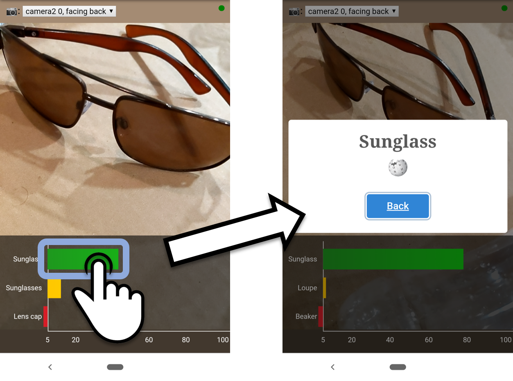

# ML5.js Image Classifier
This uses the getUserMedia query to pass user video from a selected camera into an image classifier.

## Features
### Libraries
- [ml5.js](https://ml5js.org) - image classifier used.
- [Charts.js](https://www.chartjs.org/) - used to display the top 3 results in a horizontal bar graph.
- [Sweetalert2.js](https://sweetalert2.github.io/) - used to display the results of the image classification.
  - It can be triggered when the classifier reaches a certainty of 90% or higher or when the user clicks on the bar graph.

### Prettification
- Background color is set to the average video RGB color value
  - [Uses this code](http://jsfiddle.net/xLF38/818/)
- User can select between any of their **multiple cameras**
- Made **bar graph clickable** 
  - Pulls up a sweetalert pop-up for that classification

